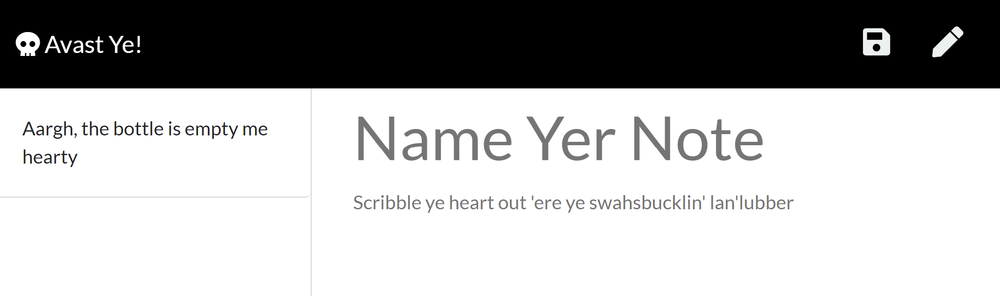

[](http://unlicense.org/)
# Easy Note
## Description
Note taker using an Express.js backend and JSON files to save and retrieve notes.

> - [Heroku](https://rocky-oasis-06805.herokuapp.com/)
> - [GitHub](https://github.com/JayArghArgh/easy-note)

## Table of Contents
> - [Description](#Description)
> - [Table of Contents](#Table-of-Contents)
> - [Installation](#Installation)
> - [Usage](#Usage)
> - [License](#License)
> - [Contributing](#Contributing)
> - [Tests](#Tests)
> - [Questions](#Questions)

## Installation
App is deployed via Heroku, to install locally, clone and then ```npm i```
## Usage
App is deployed via Heroku, to run locally, install and then ```node server.js```
## License
This application is covered under The Unlicense.
## Contributing
Please report any bugs you find.
## Tests
N/A
## Questions
Please refer any questions to [](https://github.com/JayArghArgh) via jayarghargh@gmail.com.

[](https://github.com/JayArghArgh/github-readme-stats)


> [](https://github.com/JayArghArgh) This README.md created with [](https://github.com/JayArghArgh/pro-readme-generator).

